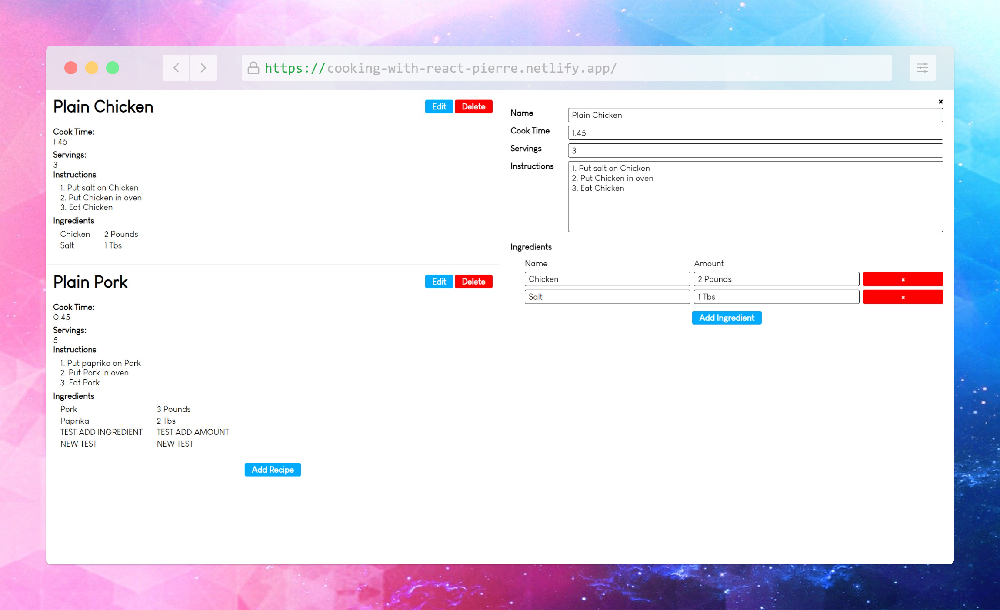

# Cooking Book 👨🏻‍🍳

Hey guys ;)

I've been practising my react skills with another amazing training you can find right here : <https://courses.webdevsimplified.com/>

The goal of this exercise was to create a kind of *interactive recipe book* that allow the user to create, edit and delete any cooking recipe added on the website.

Feel free to send me some improvements or impressions 😉

**The application is available online on this URL** : https://cooking-with-react-pierre.netlify.app/


## A little preview 🧐




## The toolBox 🛠️

I've used several react hooks :

- useState
- useEffect
- useContext

To interact with the state of my app and to pass a context through different layers.

I've discovered and used grid in my CSS file, a lot ! It changes a bit from the flexbox 😎

On this course, i've learned to use ```localstorage``` to use persistence of data client-side :

```javascript
useEffect(() => {
    localStorage.setItem(LOCAL_STORAGE_KEY, JSON.stringify(recipes));
  }, [recipes]);
```

## Deployment 🛫

To deploy this project i've used <https://www.netlify.com>

[](https://app.netlify.com/sites/wonderful-horse-05d5b7/deploys)

## Future features

Many updates are actually in my mind...

- I'd like to add a search bar for recipes that would be user-friendly

- Allow a notation system either on the difficulty and the taste 😏

- Of course i'll need to improve the CSS ! It's only functionnal, right now 😉

### Wanna get in touch ?

Feel free to contact me on my **LinkedIn** account :  <https://www.linkedin.com/in/pierre-ricard-/>

Or to connect on my **GitHub** account : <https://github.com/Pierre747>
